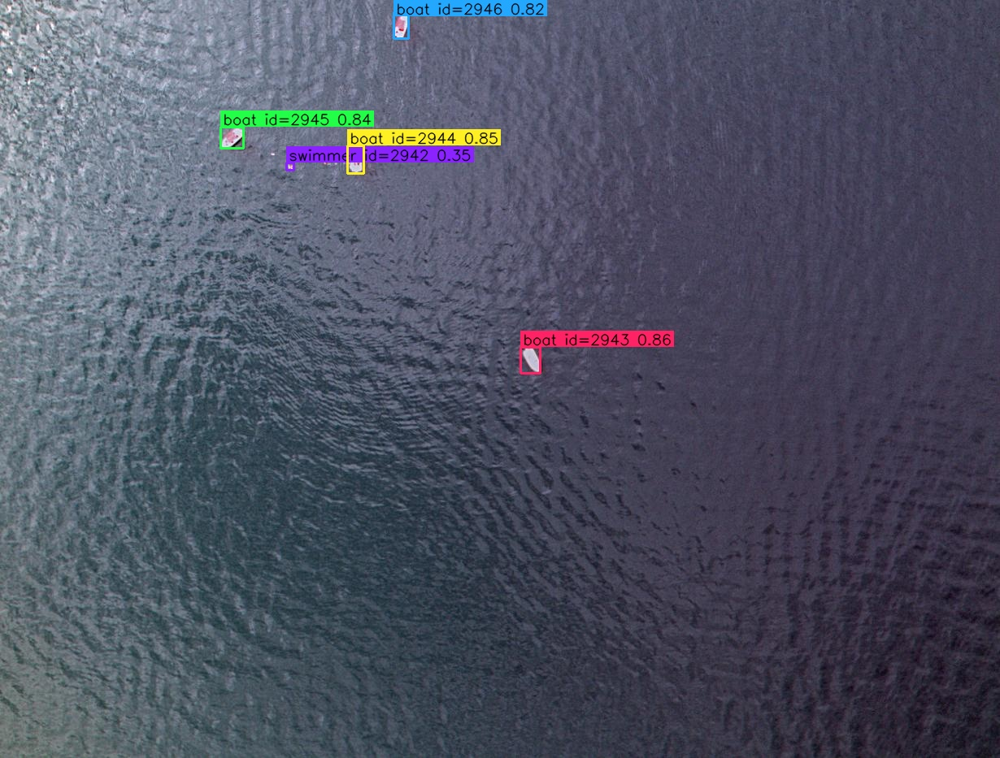
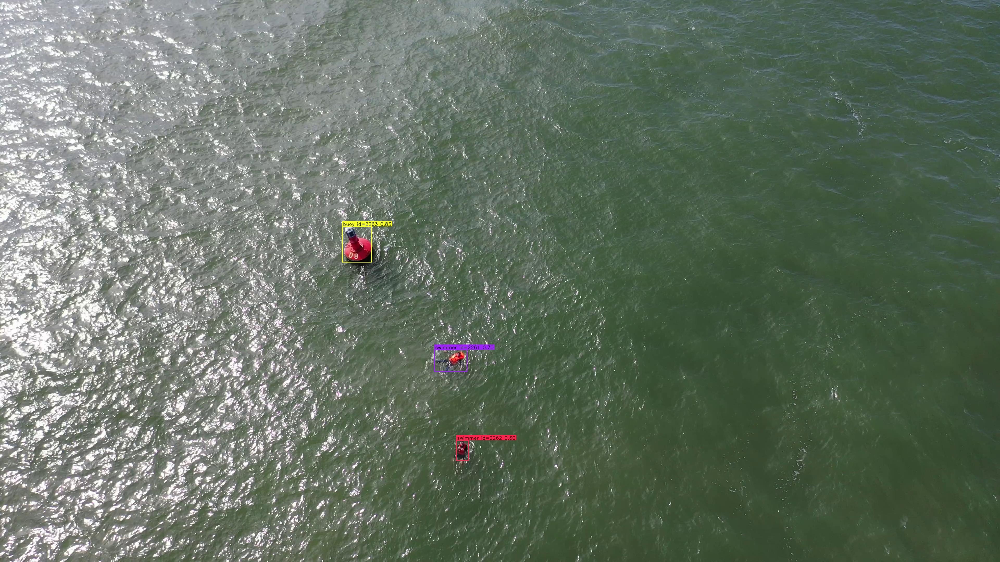

# seasurface_detector

Консольная утилита на C++17 для детектирования надводных объектов на изображениях/видео, сохранения результатов (bbox + CSV), опционального трекинга (ID) и оценки качества (Precision/Recall) по GT.

Поддерживаются:
- вход: одиночное изображение / директория с изображениями / видео
- выход: изображения/видео с bbox + CSV с детекциями
- инференс: **CPU** и **GPU (CUDA)** через **ONNX Runtime CUDA Execution Provider**

---

## 0) Требования
- Ubuntu 24.04
- CMake ≥ 3.16, компилятор C++17 (g++/clang++)
- OpenCV (dev-пакеты)
- ONNX Runtime (CPU или GPU сборка)
- Для GPU режима: NVIDIA драйвер + CUDA runtime libs + cuDNN 9

---

## 1) Установка зависимостей

### 1.1 Системные пакеты
```bash
sudo apt-get update
sudo apt-get install -y \
  build-essential cmake \
  libopencv-dev
```

### 1.2 ONNX Runtime (CPU/GPU)

Проект ожидает ONNX Runtime в:
```
third_party/onnxruntime/
  include/
  lib/
```

Скачайте CPU/GPU(CUDA) сборку ONNX Runtime (tgz), распакуйте в `third_party/onnxruntime`. Версия для GPU уже содержит необходимые пакеты для работы на CPU.

После сборки программы проверьте, что используется нужный ONNX Runtime из third_party:
```bash
ldd build/seasurface_detector | grep onnxruntime
```
Должно указывать на `.../third_party/onnxruntime/lib/libonnxruntime.so...`

После распаковки проверьте зависимости CUDA провайдера (если установлена версия для GPU):
```bash
ldd third_party/onnxruntime/lib/libonnxruntime_providers_cuda.so | grep "not found" || echo "OK: all deps found"
```

Минимальный набор:
- `libcublas.so.12`
- `libcublasLt.so.12`
- `libcurand.s0.10`
- `libcufft.so.11`
- `libcudart.so.12`
- `libcudnn.so.9`

### 1.3 Установка cuDNN 9 (если `libcudnn.so.9 => not found`)
Обычно это делается через репозиторий NVIDIA (через `cuda-keyring`). Важно создать `pin` в `/etc/apt/preferences.d/`, разрешающий скачивание только необходимых пакетов, чтобы пакеты из репозитория NVIDIA не конфликтовали с пакетами из репозитория вашей системы. Необходимо установить пакет `cudnn9-cuda-12`.

### 1.4 NVIDIA драйвер
```bash
nvidia-smi
```
Должна выводиться ваша видеокарта и версия драйвера, без ошибок.

---

## 2) Сборка программы

```bash
cmake -S . -B build -DCMAKE_BUILD_TYPE=Release -DCMAKE_EXPORT_COMPILE_COMMANDS=ON
cmake --build build -j
```

Параметр `-DCMAKE_EXPORT_COMPILE_COMMANDS=ON` необязателен. Он используется для получения списка комманд компиляции, которые нужны для настройки среды VS Code.

---

## 3) Запуск программы

**ВАЖНО** В этом проекте используется CLI-парсер OpenCV. Аргументы передаются **в формате `--ключ=значение`** (поэтому `bash` не будет разворачивать `~`).

### Примеры

#### A) Одиночное изображение
```bash
./build/seasurface_detector \
  --input=datasets/seadronessee_yolo/val/images/48.jpg \
  --model=models/best.onnx \
  --classes=models/classes.txt \
  --track=false
```

#### B) Директория с изображениями
```bash
./build/seasurface_detector \
  --input=datasets/seadronessee_yolo/val/images \
  --model=models/best.onnx \
  --classes=models/classes.txt \
  --track=false
```

#### C) Видео
```bash
./build/seasurface_detector \
  --input=~/Downloads/ship_video.mov \
  --model=models/best.onnx \
  --classes=models/classes.txt \
  --use_gpu=true
```

---

## 4) Демонстрация работы



---

## 5) Флаги CLI

```
./build/seasurface_detector
seasurface_detector (C++17/OpenCV) - maritime surface object detection
Usage: seasurface_detector [params] 

        -?, -h, --help, --usage
                print this message
        --class_agnostic (value:true)
                if true, ignore class_id in eval
        --classes
                path to classes.txt (one class name per line)
        --conf (value:0.25)
                confidence threshold
        --eval (value:false)
                compute Precision/Recall (requires --gt_csv)
        --gt_csv
                ground truth csv for evaluation
        -i, --input
                path to image / directory / video (required)
        --imgsz (value:640)
                inference image size (must match ONNX unless dynamic)
        --iou (value:0.5)
                IoU threshold for eval and tracking
        --max_missed (value:30)
                tracker max missed frames
        --model
                path to ONNX model (YOLOv8, requires --classes)
        --nms (value:0.45)
                NMS IoU threshold
        -o, --output (value:out)
                output directory
        --track (value:true)
                enable simple tracking IDs
        --use_gpu (value:false)
                use GPU for DNN inference if available
```

---

## 6) Форматы CSV

### 6.1 CSV детекций (`--csv=...`)
```
source,frame,track_id,class_id,class_name,conf,x,y,w,h
```

### 6.2 GT CSV (`--gt_csv=...`)
Ожидается:
```
source,frame,class_id,x,y,w,h
```

---

## 7) Описание алгоритмов


---

## 8) Обучение YOLO + экспорт в ONNX
Была натренирована модель `yolov8n.pt`

### 8.1 Python окружение
```bash
python3 -m venv .venv
source .venv/bin/activate
pip install -U pip
```

### 8.2 Установка Ultralytics
```bash
pip install ultralytics opencv-python pyyaml
```

### 8.3 Установка PyTorch (рекомендуется с CUDA)
PyTorch устанавливается по официальной команде с сайта PyTorch под среду.
После установки проверьте:
```bash
python - <<'PY'
import torch
print("torch:", torch.__version__)
print("cuda available:", torch.cuda.is_available())
if torch.cuda.is_available():
    print("gpu:", torch.cuda.get_device_name(0))
PY
```

### 8.4 Конвертация COCO -> YOLO
Использованный датасет Seadronessee анотирован в формате COCO. YOLO же ожидает одноименную нотацию.
Для конвертации используются следующие написанные утилиты:
```bash
python tools/convert_coco_to_yolo.py \
  --coco_json=datasets/seadronessee_raw/annotations/instances_train.json \
  --images_dir=datasets/seadronessee_raw/images/train \
  --out_dir=datasets/seadronessee_yolo/train

python tools/convert_coco_to_yolo.py \
  --coco_json=datasets/seadronessee_raw/annotations/instances_val.json \
  --images_dir=datasets/seadronessee_raw/images/val \
  --out_dir=datasets/seadronessee_yolo/val
```

Должно получиться:
```
datasets/seadronessee_yolo/train/images
datasets/seadronessee_yolo/train/labels
datasets/seadronessee_yolo/train/classes.txt

datasets/seadronessee_yolo/val/images
datasets/seadronessee_yolo/val/labels
datasets/seadronessee_yolo/val/classes.txt
```

Необходимо скопировать любой файл `classes.txt` в папку `models` (они должны быть идентичны).
```
models/classes.txt
```

### 8.5 dataset.yaml
Пример имён классов (в правильном порядке):
```
swimmer
boat
jetski
life_saving_appliances
buoy
```

Для обучения модели необходимо создать yaml:
```bash
python tools/make_dataset_yaml.py \
  --train_dir=datasets/seadronessee_yolo/train \
  --val_dir=datasets/seadronessee_yolo/val \
  --names="swimmer,boat,jetski,life_saving_appliances,buoy" \
  --out=datasets/seadronessee_yolo/seadronessee.yaml
```

### 8.6 Обучение
```bash
yolo detect train \
  data=datasets/seadronessee_yolo/seadronessee.yaml \
  model=yolov8n.pt \
  imgsz=640 \
  epochs=50 \
  batch=16 \
  device=0
```

### 8.7 Экспорт в ONNX
```bash
yolo export \
  model=runs/detect/train/weights/best.pt \
  format=onnx \
  imgsz=640
```

Перенесите результат:
```
models/best.onnx
```

---

## 9) GT CSV для метрик

```bash
python tools/yolo_to_gt_csv.py \
  --images_dir=datasets/seadronessee_yolo/val/images \
  --labels_dir=datasets/seadronessee_yolo/val/labels \
  --out=gt_val.csv
```

---

## 10) Бенчмарк
```bash
./build/seasurface_detector \
  --input=datasets/seadronessee_yolo/val/images \
  --output=out_eval \
  --csv=out_eval/dets.csv \
  --gt_csv=gt_val.csv \
  --eval=true \
  --iou=0.5 \
  --class_agnostic=true \
  --model=models/best.onnx \
  --classes=models/classes.txt \
  --use_gpu=true
```

## 11) Выводы
Резудьтаты бенчмарка (разрешение `1230x933`, `IoU=0.5`, `1547` кадров) следующие:
- Общее время обработки: `71.933 с`
- Среднее время обработки кадра: `46.498 мс`
- `TP: 6261`
- `FP: 1157`
- `FN: 3369`
- `Precision: 0.8440`
- `Recall: 0.6502`

Более лучших результатов можно добиться, если:
- Тренировать более тяжелую модель (`yolov8n.pt` -- самая маленькая)
- Тренировать на большем разрешении (использовалось `640x640`)
- При конвертации датасета отбросить лишние классы (например, `swimmer`)
- Использовать другие параметры `conf`, `nms`, `iou`, `max_missed`